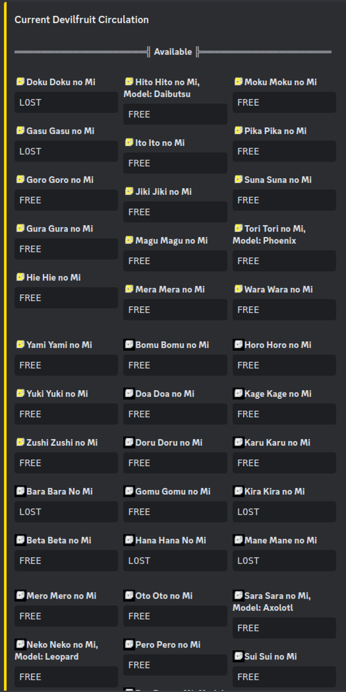

<p align="center">
 

<h1 align="center">Devil Fruit Circulation Bot</h1>

<p align="center"> Devil Fruit Circulation Bot is a Minecraft Addon for the popular <a href="https://www.curseforge.com/minecraft/mc-mods/mine-mine-no-mi"> Mine Mine no Mi Mod</a> mod.</p>

<p align="center">
 
</p>  


## Important

In order for the addon to work several changes to the main Mine Mine no Mi mod had to be made.  
Those changes have already been committed by me to the main mod and will be available with the next Update.  
Specifics can be found [here](https://github.com/rathmerdominik/MineMineNoMiModded).  

It is imperative that for now this custom version is used. Changes in there are purely server sided. So only you need to install this version on your server.  
Players can still use the normal Mine Mine no Mi Version.

I HAVE EXPLICIT PERMISSION BY THE CREATOR OF THE MINE MINE NO MI MOD TO REDISTRIBUTE THIS.  
YOU DO NOT! THEREFORE EVERY FURTHER REDISTRIBUTION HAS TO HAPPEN BY REFERENCING TO THIS PAGE!


## Installation

```
git clone https://github.com/rathmerdominik/MineMineNoMiDevilFruitCirculationBot.git
cd MineMineNoMiDevilFruitCirculationBot
cd libs
curl -O -L https://github.com/rathmerdominik/MineMineNoMiModded/raw/main/release/mine-mine-no-mi-0.9.5-HAMMER.jar
cd ..
./gradlew build
```

From there you can take the jar out of the `build/libs` folder  

## Dependencies

This mod depends on the latest 1.16.5 version of [Discord Integration](https://modrinth.com/plugin/dcintegration) therefore you must get and configure this addon as well!

## Configuration Options

```toml
[EmbedDesign]
	#Color for the generated Embed in Hexadecimal
	"Color Hex" = "0xFFD700"
	#Sort Devil Fruits by Alphabet
	"Sort by Alphabet" = false
	#Sort Devil Fruits by their Tier
	"Sort By Tier" = true
	#The title of the Embed
	"Embed Title" = "Current Devilfruit Circulation"
	#The footer of the Embed
	"Embed Footer" = "Made by DerHammerclock | Last updated"
	#Show a date next to the footer when the embed has been updated
	"Show Last Updated" = true

[General]
	#Show the current Status of the Fruit as well if it has one
	"Show Fruit Status" = false
	#In which mode the Bot is supposed to work.
	#Allowed Values: ONLY_SHOW_AVAILABLE, SHOW_AVAILABLE_AND_UNAVAILABLE, ONLY_SHOW_UNAVAILABLE
	"Circulation Bot Mode" = "ONLY_SHOW_AVAILABLE"
	#Channel ID to where the Circulation Messages will be send. Please make sure the bot has write access!
	#Range: 0 ~ 9223372036854775807
	"Channel ID" = 0
	#DO NOT TOUCH. WILL BE GENERATED
	#Range: 0 ~ 9223372036854775807
	"Message ID" = 0

[Emojis]
	#Discord Emoji ID to represent a Gold Box.
	#Range: 0 ~ 9223372036854775807
	"Gold Box Emoji ID" = 0
	#Discord Emoji ID to represent a Wooden Box.
	#Range: 0 ~ 9223372036854775807
	"Wooden Box Emoji ID" = 0
	#Use emojis to show the rarity of a fruit
	"Use Emojis" = false
	#Discord Emoji ID to represent an Iron Box.
	#Range: 0 ~ 9223372036854775807
	"Iron Box Emoji ID" = 0
```
